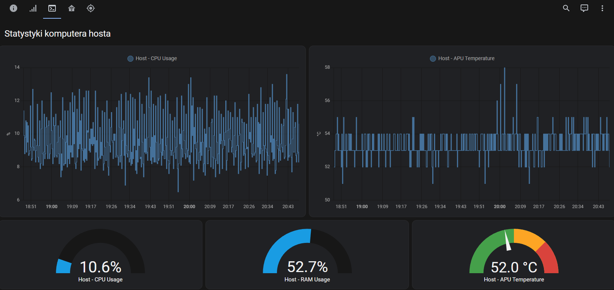

# Monitor - Hardware Monitor

This is a small utility service created to monitor parameters of my Dell Wyse 5060 thin client, serving as the host for a Smart Home (Home Assistant) virtual machine. The virtual machine operates on the Windows platform, and additionally, we utilize this unit as a TV set-top box, leveraging its capability to run Kodi. With only passive cooling (fanless), it's advisable to keep an eye on the APU temperature and CPU usage for this machine and it was my motivation to write this code.

## Compile

To compile use PyInstaller:
`python -m PyInstaller --onefile monitor.py --windowed`

It will output an executable file in dist directory.

# Configuration
Place configuration file (config.ini) next to the executable:

```ini
[credentials]
user=<username for mqtt>
pass=<password for mqtt>
host=<host for mqtt>
```

## Installation

To install the service, follow these steps:

1. Build thhe executable.
2. Create configuration file.
3. Move the executable file (and config) to a stable and secure path to prevent accidental removal.
4. Open a command prompt with administrative privileges.
5. Navigate to the directory where you extracted HWMon.
6. Run `monitor.exe install` to install the task.

The task should appear in Windows Task Scheduler.

To remove the task:
1. First, locate the `monitor.exe` in Task Manager and kill the process.
2. Run `monitor.exe uninstall` or remove the task in Task Scheduler UI.

## Technical details
It will probably grow in the future but for now, the tool publishes three things to MQTT:

| Topic | Value |
|------------|------------|
| <prefix>/ram_used_percent | RAM in use (in percent) |
| <prefix>/gpu_temperature_celsius | GPU temperature, can be treated as APU temperature on Dell Wyse 5060 |
| <prefix>/cpu_utilization_percent | CPU usage in percent (should be close to the value you see in Task Manager) |

`<prefix>` is `hwmon` (I'll add this to config as an option soon)

## Screenshot
